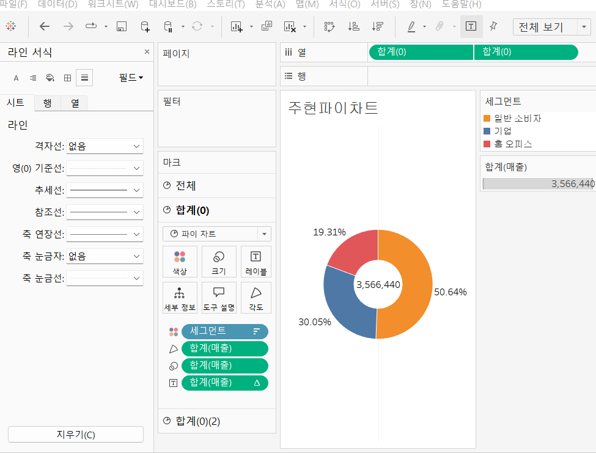
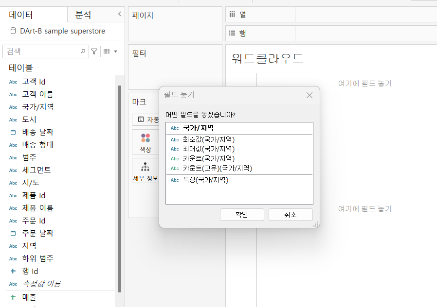
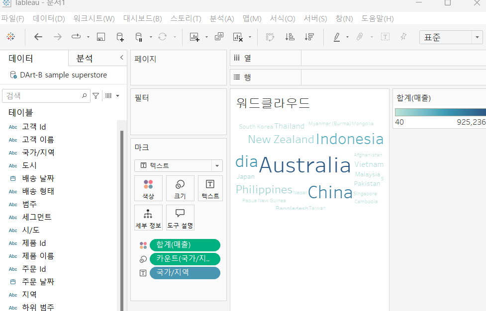
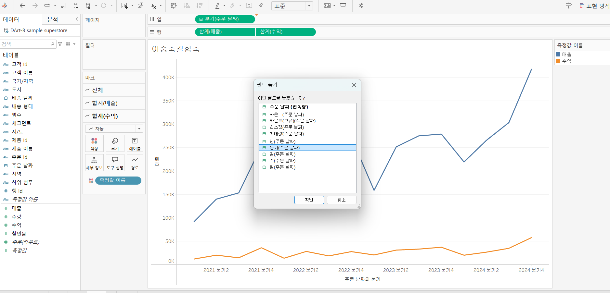
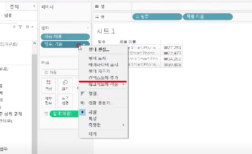
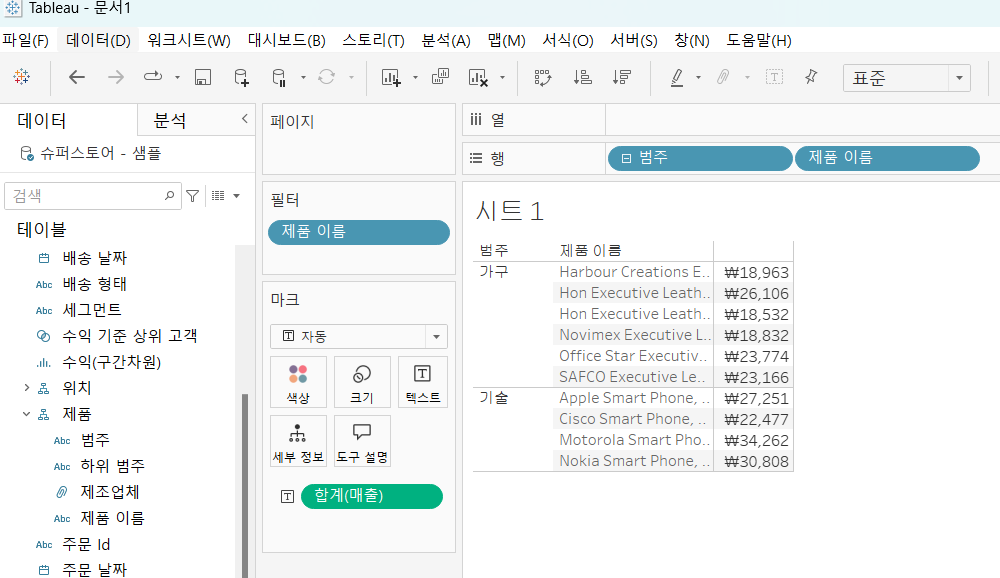

# Third Study Week

- 20강: [파이와 도넛차트](#20강-파이와-도넛차트)

- 21강: [워드와 버블차트](#21강-워드와-버블차트)

- 22강: [이중축과 결합축](#22강-이중축과-결합축)

- 23강: [분산형 차트](#23강-분산형-차트)

- 24강: [히스토그램](#24강-히스토그램)

- 25강: [박스플롯](#25강-박스플롯)

- 26강: [영역차트](#26강-영역차트)

- 27강: [간트차트](#27강-간트차트)

- 28강: [필터](#28강-필터)

- 29강: [그룹](#29강-그룹)


- 문제1 : [문제1](#문제1)

- 문제2 : [문제2](#문제2)

- 참고자료 : [참고자료](#참고-자료)


## Study Schedule

| 강의 범위     | 강의 이수 여부 | 링크                                                                                                        |
|--------------|---------|-----------------------------------------------------------------------------------------------------------|
| 1~9강        |  ✅      | [링크](https://youtu.be/3ovkUe-TP1w?si=CRjj99Qm300unSWt)       |
| 10~19강      | ✅      | [링크](https://www.youtube.com/watch?v=AXkaUrJs-Ko&list=PL87tgIIryGsa5vdz6MsaOEF8PK-YqK3fz&index=75)       |
| 20~29강      | ✅      | [링크](https://www.youtube.com/watch?v=Qcl4l6p-gHM)      |
| 30~39강      | 🍽️      | [링크](https://www.youtube.com/watch?v=e6J0Ljd6h44&list=PL87tgIIryGsa5vdz6MsaOEF8PK-YqK3fz&index=55)       |
| 40~49강      | 🍽️      | [링크](https://www.youtube.com/watch?v=AXkaUrJs-Ko&list=PL87tgIIryGsa5vdz6MsaOEF8PK-YqK3fz&index=45)       |
| 50~59강      | 🍽️      | [링크](https://www.youtube.com/watch?v=AXkaUrJs-Ko&list=PL87tgIIryGsa5vdz6MsaOEF8PK-YqK3fz&index=35)       |
| 60~69강      | 🍽️      | [링크](https://www.youtube.com/watch?v=AXkaUrJs-Ko&list=PL87tgIIryGsa5vdz6MsaOEF8PK-YqK3fz&index=25)       |
| 70~79강      | 🍽️      | [링크](https://www.youtube.com/watch?v=AXkaUrJs-Ko&list=PL87tgIIryGsa5vdz6MsaOEF8PK-YqK3fz&index=15)       |
| 80~89강      | 🍽️      | [링크](https://www.youtube.com/watch?v=AXkaUrJs-Ko&list=PL87tgIIryGsa5vdz6MsaOEF8PK-YqK3fz&index=5)        |


<!-- 여기까진 그대로 둬 주세요-->
<!-- 이 안에 들어오는 텍스트는 주석입니다. -->

# Third Study Week

## 20강: 파이와 도넛차트

- 세그먼트와 매출을 더블 클릭 => 표현 방식을 `파이 차트`로 바꾸기
- 내림차순 정렬
- 매출을 레이블 마크카드에 드래그하고 퀵테이블 계산 => 구성비율로 바꾸기

#### 이중축 사용해 도넛차트 만들기
1. 열 선반을 더블클릭 하고 '0'을 입력해서 ctrl키 누른채로 옆으로 드래그 하면 파이차트 2개가 생긴다. 
2. 마크 카드에서 똑같이 생긴 하나의 파이차트는 모든 설정을 다 빼서 공허한 원으로 만든다. 
3. 열 선반에서 합계(0)에 우클릭하여 `이중축` 선택하면 하나로 합쳐짐 
4. 이후 안에 있는 원 모양의 색상, 매출 등을 바꿔준다.

> **🧞‍♀️ 도넛차트를 생성하는 법을 기록해주세요.**



## 21강: 워드와 버블차트

#### 지역과 매출에 따른 버블차트 그리기

1. ctrl 키를 누른채 국가/지역과 매출필드를 선택해서 '표현 방식'을 `버블차트` 로 한다. => 매출 필드를 색상 마크에 드래그 
2. 자유롭게 꾸민다

#### 워드클라우드 그리기



1. 국가/지역 필드를 우클릭한 채로 시트에 드래그 하면 위의 사진처럼 뜸. 거기서 `카운트(국가/지역)` 선택
2. 그다음 국가/지역을 다시 '텍스트' 마크카드에 드래그 함.
3. 그다음 마크 창에서 '자동' -> `텍스트`로 바꿔줌



## 22강: 이중축과 결합축

- 이중 축: 각각의 마크 창 사용 가능
- 결합 축: 하나의 마크 창 공유

#### 주문일자의 분기를 기준으로 매출/수익 비교하기


1. 주문날짜 필드를 `우클릭하여 열선반으로 드래그`하면 사진과 가튼 창이 뜸 => `연속형-분기` 선택
2. 매출과 수익 필드 더블클릭하면 각각에 대한 view 가 생김
3. 행 선반의 '수익'필드 역삼각형에서 **이중 축** 클릭 
4. 축 동기화

#### 결합 축
- 가장 큰 범위의 축을 공유하는 축
- '수익' 필드를 '매출' 축의 **왼쪽으로** 드래그하면 초록섹 네모 두개가 뜨는데 그게 결합축


## 23강: 분산형 차트
<!-- 분산형 차트에 관해 배우게 된 점을 적어주세요 -->


## 24강: 히스토그램
<!-- 히스토그램에 관해 배우게 된 점을 적어주세요 -->


## 25강: 박스플롯
<!-- 박스플롯에 관해 배우게 된 점을 적어주세요 -->

## 26강: 영역차트
<!-- 영역차트에 관해 배우게 된 점을 적어주세요 -->

## 27강: 간트차트
<!-- 간트차트에 관해 배우게 된 점을 적어주세요 -->

## 28강: 필터



- 필터를 실행하는 순서: `추출 - 데이터원본 - 컨텍스트 - 차원 - 측정값 - 필터` 순으로 동작
- 추출을 다른 이름으로 저장: 이 저장주소에 있는 로컬 데이터와만 연동해서 작업할수 있도록 
- `컨텍스트 필터`: 를 사용하면 다른 필터가 컨텍스트 필터에 종속되어 작동함 (컨텍스트 필터가 다른 필터보다 상위 필터라서) 
    - ex. 상위 매출 10개인 제품명만 필터링 하기
    - 제품 이름 필드를 필터 창에 드래그한다.
    - 범주 필드도 필터 창에 드래그하면 데이터가 왜곡 → 범주:기술 필드를 ‘컨텍스트에 추가’하면 **범주필터가 우선적으로 작용하고 매출 필드가 종속적으로 적용**됨

## 29강: 그룹
- 그룹을 이용해 수동으로 필드를 묶을 수 있으며 
- 기존 데이터 원본에 없는 ***사용자 지정 그룹 필드*** 만들기 가능
- 제품이름(열), 수익(행)에 드래그하면 각 회사의 제품들이 얼마나 많은 수익을 냈는지 그래프로 보여줌 → 각 회사별로 grouping 하자.
    - 뷰(시트 제일 큰 화면)에서 grouping 가능 (드래그해서)
- `제품 이름 필드`에 들어가서 `마우스 우클릭 → 만들기 → 그룹` 으로 **수동 필드 묶기** 가능 → 그룹 다 만들고 제품이름(그룹)을 마크카드의 색상에 드래그하면 그래프 색깔로 구분가능

## 문제 1.

```js
유정이는 superstore 데이터셋에서 '주문' 테이블을 보고 있습니다.
1) 국가/지역 - 시/도- 도시 의 계층을 생성했습니다. 계층 이름은 '위치'로 설정하겠습니다.
2) 날짜의 데이터 타입을 '날짜'로 바꾸었습니다.

코로나 시기의 도시별 매출 top10을 확인하고자
1) 배송 날짜가 코로나시기인 2021년, 2022년에 해당하는 데이터를 필터링했고
2) 위치 계층을 행으로 설정해 펼쳐두었습니다.
이때, 수익의 합계가 TOP 10인 도시들만을 보았습니다.
```


```
겉보기에는 전체 10개로, 잘 나온 결과처럼 보입니다. 그러나 유정이는 치명적인 실수를 저질렀습니다.
오늘 배운 '컨텍스트 필터'의 내용을 고려하여 올바른 풀이 및 결과를 구해주세요.
```

```
문제 답변: 컨텍스트 필터를 적용 안해서 년(배송날짜) 필터와 도시 필터가 독립적으로 작용한다. 이렇게되면 모든 연도에 대해서 도시 필터링을 하게 되는데, 2021년, 2022년 데이터에 대해서 상위 10개 추출임! 
```


## 문제 2.

```js
태영이는 관심이 있는 제품사들이 있습니다. '제품 이름' 필드에서 '삼성'으로 시작하는 제품들을 'Samsung group'으로, 'Apple'으로 시작하는 제품들을 'Apple group'으로, 'Canon'으로 시작하는 제품들을 'Canon group'으로, 'HP'로 시작하는 제품들을 'HP group', 'Logitech'으로 시작하는 제품들을 'Logitech group'으로 그룹화해서 보려고 합니다. 나머지는 기타로 설정해주세요. 이 그룹화를 명명하는 필드는 'Product Name Group'으로 설정해주세요.

(이때, 드래그보다는 멤버 찾기 > 시작 문자 설정하여 모두 찾아 한번에 그룹화해 확인해보세요.)
```


```js
해당 그룹별로 어떤 국가/지역이 주문을 많이 차지하는지를 보고자 합니다. 매출액보다는 주문량을 보고 싶으므로, 주문Id의 카운트로 계산하겠습니다.

기타를 제외하고 지정한 5개의 그룹 하위 목들만을 이용해 아래와 같이 지역별 누적 막대그래프를 그려봐주세요.
```

