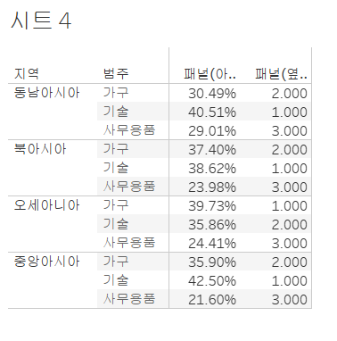

# Fourth Study Week

- 30강: [계층](#30-계층)

- 31강: [집합](#31-집합)

- 32강: [결합집합](#32-결합집합)

- 33강: [계산된 필드](#33-계산된-필드)

- 34강: [행수준계산](#34-행수준계산)

- 35강: [집계계산](#35-집계계산)

- 36강: [테이블계산](#36-테이블계산)

- 37강: [퀵테이블계산(1)](#37-퀵테이블계산1)

- 38강: [퀵테이블계산(2)](#38-퀵테이블계산2)

- [문제1](#문제-1)

- [문제2](#문제-2)

- [문제3](#문제-3)

## Study Schedule

| 강의 범위     | 강의 이수 여부 | 링크                                                                                                        |
|--------------|---------|-----------------------------------------------------------------------------------------------------------|
| 1~9강        |  ✅      | [링크](https://www.youtube.com/watch?v=AXkaUrJs-Ko&list=PL87tgIIryGsa5vdz6MsaOEF8PK-YqK3fz&index=84)       |
| 10~19강      | ✅      | [링크](https://www.youtube.com/watch?v=AXkaUrJs-Ko&list=PL87tgIIryGsa5vdz6MsaOEF8PK-YqK3fz&index=75)       |
| 20~29강      | ✅      | [링크](https://www.youtube.com/watch?v=AXkaUrJs-Ko&list=PL87tgIIryGsa5vdz6MsaOEF8PK-YqK3fz&index=65)       |
| 30~38강      | ✅      | [링크](https://youtu.be/e6J0Ljd6h44?si=nhGbB7GsdOCqj15f)       |
| 39~49강      | 🍽️      | [링크](https://www.youtube.com/watch?v=AXkaUrJs-Ko&list=PL87tgIIryGsa5vdz6MsaOEF8PK-YqK3fz&index=45)       |
| 50~59강      | 🍽️      | [링크](https://www.youtube.com/watch?v=AXkaUrJs-Ko&list=PL87tgIIryGsa5vdz6MsaOEF8PK-YqK3fz&index=35)       |
| 60~69강      | 🍽️      | [링크](https://www.youtube.com/watch?v=AXkaUrJs-Ko&list=PL87tgIIryGsa5vdz6MsaOEF8PK-YqK3fz&index=25)       |
| 70~79강      | 🍽️      | [링크](https://www.youtube.com/watch?v=AXkaUrJs-Ko&list=PL87tgIIryGsa5vdz6MsaOEF8PK-YqK3fz&index=15)       |
| 80~89강      | 🍽️      | [링크](https://www.youtube.com/watch?v=AXkaUrJs-Ko&list=PL87tgIIryGsa5vdz6MsaOEF8PK-YqK3fz&index=5)        |

<!-- 여기까진 그대로 둬 주세요-->

> **🧞‍♀️ 오늘의 스터디는 지니와 함께합니다.**


## 30. 계층

- 태블로는 `날짜 데이터`와 함께 제공되는 경우에 자동으로 계층을 생성함
- 위치 필드는 **지역 - 국가/지역 - 시/도 - 도시** 순으로 계층이 있음
- 두개의 필드를 동시에 잡고 우클릭 → 계층 → 계층 만들기
- 계층화된 위치필드를 선반에 드래그 → 왼쪽 +버튼 누르면 계층에 따라 정렬

## 31. 집합

- 사용자가 특정조건을 설정하여 데이터들을 구분
    - 수익을 많이 낸 상위10개 도시 표현
- 시/도 필드 → 우클릭 → 만들기 → 집합

## 32. 결합집합

- 집합에서 `두 가지의 조건`을 적용하고 싶을때는 어떻게 해야할까?
- ex) 매출이 5만원 이상이고 수익률이 10%이상인 도시들
    - `매출` 필드를 `텍스트` 마크창에, 매출 `5만원이상` 인 집합을 `색상` 마크창에
    - `수익률` 필드를 `텍스트` 마크창에, 수익률 `10%이상` 인 집합을 `색상` 마크창에
    - 그 후 집합된 필드를 우클릭 → 결합집합 만들기


## 33. 계산된 필드

- 방법
    - 1, `데이터 패널`을 통해 생성
    - 2, 분석 탭 → `계산된 필드 만들기`
    - 3, 사용하고자 하는 필드에 마우스 우클릭
- 제품별로 얼마나 수익을 냈는지 백분율로 나타내기


## 34. 행수준계산

- 종류: 
    1) 기본 계산
    2) 테이블 계산
    3) LOD 표현식

- 행수준계산 / 집계계산

#### **고객이름을 성과 이름으로 분리하기**
    - 순서상 이름이 먼저와서 토큰 번호 1, 성을 분리하고 싶으면 토큰 번호 2 입력하면됨


#### 수익성이 있는 제품들에 어떤 것이 있는지?
    - if then 함수 사용하기


#### 주문한 날짜로부터 주문이 배송된 날까지, 두 날짜 사이의 일수 찾기
    - DATEDIFF 함수 사용
    - 측정값을 차원값으로 변경 필요
    - 주문 아이디가 여러개의 record를 가진 경우 일 수를 전부 합산해버리기 때문


## 35. 집계계산

- 매출 => 우클릭 => 기본속성 => 집계
- 계산된 필드 => 오른쪽 창 => 집계함수 

#### 합계 매출 집계 계산 만들어보기

#### 연도별 주문건수 보기


## 36. 테이블계산

> 테이블 계산이란? 
- 뷰에 보이는 내용을 바탕으로 데이터가 계산되는 것

#### 1. 월마다, 연도마다 누적 매출 만들기
    - 계산된 필드 만들기 => 테이블 계산 

`RUNNING_SUM(SUM([매출]))` 입력


#### 2. 현재 달과 전 월의 차이 찾기


## 37. 퀵테이블계산(1)

- 사용하고자 하는 필드 위에 우클릭  => `퀵테이블 계산` 

### 누계: 집계한 값을 한번 더 집계하는 것

#### 분기별 누적 매출 & 월별 매출 차트 
- 마우스 우클릭 한 채로 열 선반에 끌어다 놓기
- 행 선반에 `매출` 드래그
- `이중 축`을 이용해 누적매출&월별매출 둘 다 볼 것이기 때문에 ctrl 누른 채 옆으로 이동시켜 복제


### 차이
#### 각 제품에 대한 연도별 매출 차이 알아보기 


### 비율 차이 
- 측정값들 사이의 성장률 또는 퍼센트(%) 차이


### 구성 비율

#### 지역별 제품 매출 순위와 구성 비율 만들기 


구성비율 : 전체에서 각 항목들의 비중 확인


---


- `패널(아래로)` 를 선택하면 고정비율 합이 백퍼센트를 기준으로 맞춰짐 



## 38. 퀵테이블계산(2)

1) `이동평균`: 이전의 값부터 현재까지 값에 대한 평균, 주식데이터에서 많이 활용
    - 마우스 우클릭으로 **퀵테이블 => 이동평균** 클릭


2) `YTD 총계`: 특정 시점을 기준으로 해당 연도부터 그 시점까지의 총계 
    - 각 년도 안에서 매출 합계가 누적되어 표시된다. 
    - 행선반에 주문날짜(년,월) 넣고 매출 필드 더블 클릭 => 마크카드 매출 필드에서 퀵테이블 계산 => ydt 총계

3) `전년 대비 성장률`: 같은 월을 기준으로 이전 년도 대비 얼마 정도 성장했는지를 살펴봄 
    - 같은 방식으로 퀵테이블 계산 => 전년 대비 성장률

4) `YTD 성장률`: 2021년 2월의 YDT 총계가 59,443이고 2022년 2월의 YDT 총계가 90,866이면 YDT 성장률은 52.86%

## 문제 1.

규석이는 이제껏 매출을 올리는 데에 힘썼었지만, 왠지 모르게 주머니에 들어오는 돈이 없어 속상합니다. 

그래서 매출이 상위 20곳에 속하지만, 수익률(%)이 마이너스인 시/도를 확인하려고 합니다.

> 수익률은 SUM([수익]) / SUM([매출])로 정의합니다.

어떤 집합을 만들었고, 어떤 결합을 하였는지를 중심으로 기술하고, 결과 자료를 첨부해주세요. 

(텍스트 표 형태이며, 색상으로 위 집합을 구분할 수 있게 만들어주세요.)

<!-- 아래 예시 이미지를 삭제하고, 직접 만든 시트 사진을 올려주세요. 시트의 이름은 본인 이름으로 기입해주세요-->


## 문제 2.
선희는 주문 Id별로 주문에서 배송까지에 걸리는 날짜 일수가 궁금했습니다. 
그래서 주문 ID별로 주문에서 배송까지 걸리는 일자를 '배송까지 걸린 일수'라는 계산된 필드로 만들고, 이를 마크에 올린 후 확인해보았습니다. 
이때, 계산된 필드의 식은 'DATEDIFF' 함수를 이용하였습니다.

배송까지 걸린 일수 계산을 위한 DATEDIFF 함수 수식을 적어주세요.

```
DATEDIFF(’day’, [배송 날짜], [주문 날짜])
```


그런데 위 그림처럼 '주문 날짜'와 '배송 날짜'를 함께 행에 올려 확인해보니, 주문날짜와 배송날짜의 차이가 '배송까지 걸린 일수'와 다릅니다.

ID-2021-11126을 보니, 11월 26일 배송에 11월 30일 배송이면 4일 차이인데, 12일이 걸렸다고 하네요. 왜 이런 문제가 생긴걸까요?

```
주문 아이디가 여러개의 레코드row를 가진 경우 일수를 전부 합산해버리기 때문이다
```

그리고 이를 해결하기 위해서는 어떻게 해야 할까요?

```
 측정값 → 차원값으로 변경 필요
```


## 문제 3.

다음은 Tableau의 다양한 계산을 사용할 수 있는 경우를 빈칸으로 두고 문제를 작성한 것입니다. 각 빈칸에 적합한 계산 유형을 채워보세요.

보기
> **누계, 차이, 비율 차이, 구성 비율, 순위, 백분위수, 이동 평균, YTD 총계, 통합 성장률, 전년 대비 성장률, YTD 성장률**

| 계산 유형               | 설명                                                                 | 사용 예시                                                                                          |
|-------------------------|----------------------------------------------------------------------|-----------------------------------------------------------------------------------------------------|
| 여기에 적으세요           | 데이터의 누적 합계를 계산                                             | 한 기업이 월별 매출 데이터를 누적하여 연간 매출 추이를 보고 싶을 때 사용                                      |
| ____________            | 연속 데이터 포인트 간의 차이를 계산                                    | 한 기업이 월별 매출 데이터에서 전월 대비 매출 증감량을 분석하고 싶은 경우                                        |
| ____________            | 연속 데이터 포인트 간의 비율 변화를 계산                               | 한 기업이 월별 매출 데이터에서 전월 대비 매출 증감률(%)을 분석하고 싶은 경우                                      |
| ____________            | 전체에서 각 데이터 포인트의 비율을 계산                                | 한 기업이 전체 매출에서 각 제품군이 차지하는 비율을 보고 싶을 때 사용                                           |
| ____________            | 데이터의 순위를 매깁니다                                              | 한 기업이 제품별 매출 데이터를 순위별로 정렬하여 상위 10개 제품을 분석하고 싶은 경우                              |
| ____________            | 데이터의 백분위를 계산                                               | 한 기업이 고객별 구매 금액 데이터를 백분위수로 나누어 상위 25% 고객을 분석하고 싶은 경우                          |
| ____________            | 일정 기간의 평균을 계산                                               | 한 기업이 주간 매출 데이터에서 4주 이동 평균을 계산하여 트렌드를 분석하고 싶은 경우                              |
| ____________            | 연초부터 현재까지의 총계를 계산                                      | 한 기업이 월별 매출 데이터를 연초부터 현재까지 누적하여 연간 매출 목표 달성 여부를 분석하고 싶은 경우             |
| ____________            | 일정 기간 동안의 연평균 성장률을 계산                                  | 한 기업이 5년 간 매출 데이터를 바탕으로 연평균 성장률(CAGR)을 계산하고 싶은 경우                                  |
| ____________            | 전년 동기간 대비 성장률을 계산                                        | 한 기업이 월별 매출 데이터에서 전년 동월 대비 매출 성장률을 분석하고 싶은 경우                                    |
| ____________            | 연초부터 현재까지의 성장률을 계산                                     | 한 기업이 올해 연초부터 현재까지의 매출이 전년 동기 대비 얼마나 성장했는지 분석하고 싶은 경우                     |

> 사용 예시를 참고하여 실제 경우처럼 생각하며 고민해보아요!