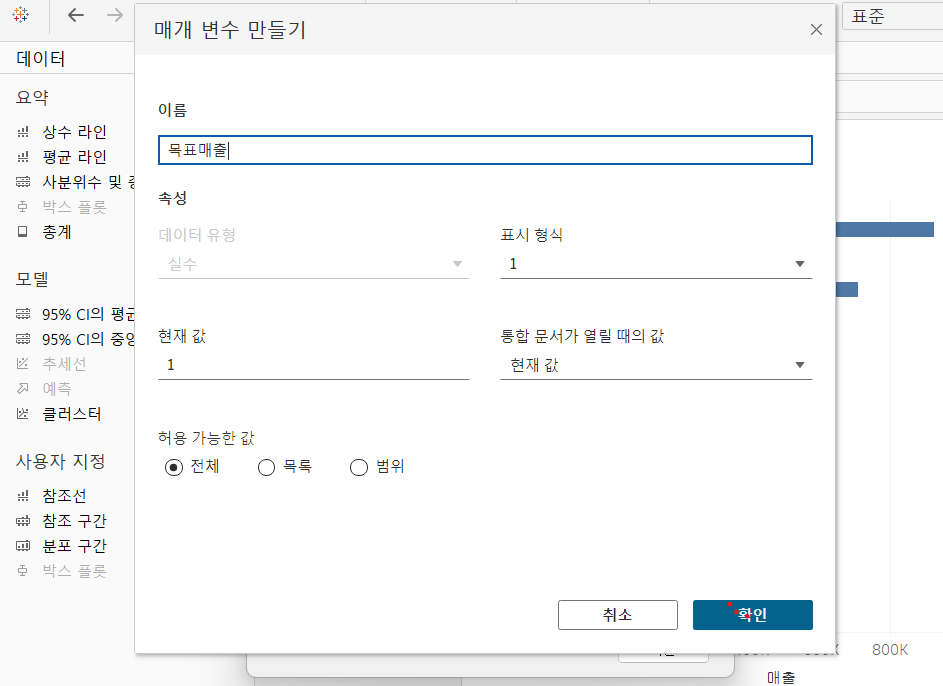
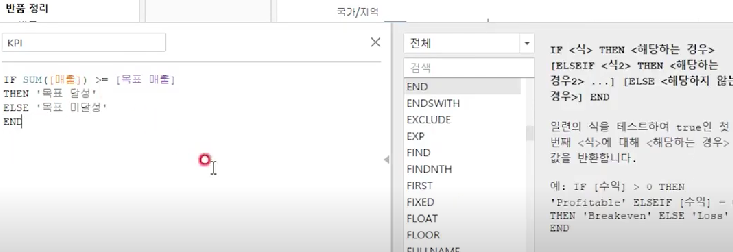

# Fifth Study Week

- 39강: [LOD](#39강-lod)

- 40강: [EXCLUDE](#40-lod-exclude)

- 41강: [INCLUDE](#41-lod-include)

- 42강 : [매개변수](#42-매개변수)

* (43강이 없어 패스합니다)
- 44강: [매개변수 실습](#44-매개변수-실습)

- 45강: [마크카드](#45-워크시트-마크카드)

- 46강: [서식계층](#46-서식-계층)

- 47강: [워크시트](#47-워크시트-서식)

- [문제1](#문제-1)

- [문제2](#문제-2)

- [문제3](#문제-3)

## Study Schedule

| 강의 범위     | 강의 이수 여부 | 링크                                                                                                        |
|--------------|---------|-----------------------------------------------------------------------------------------------------------|
| 1~9강        |  ✅      | [링크](https://www.youtube.com/watch?v=AXkaUrJs-Ko&list=PL87tgIIryGsa5vdz6MsaOEF8PK-YqK3fz&index=84)       |
| 10~19강      | ✅      | [링크](https://www.youtube.com/watch?v=AXkaUrJs-Ko&list=PL87tgIIryGsa5vdz6MsaOEF8PK-YqK3fz&index=75)       |
| 20~29강      | ✅      | [링크](https://www.youtube.com/watch?v=AXkaUrJs-Ko&list=PL87tgIIryGsa5vdz6MsaOEF8PK-YqK3fz&index=65)       |
| 30~38강      | ✅      | [링크](https://www.youtube.com/watch?v=e6J0Ljd6h44&list=PL87tgIIryGsa5vdz6MsaOEF8PK-YqK3fz&index=55)       |
| 39~47강      | ✅      | [링크](https://www.youtube.com/watch?v=AXkaUrJs-Ko&list=PL87tgIIryGsa5vdz6MsaOEF8PK-YqK3fz&index=45)       |
| 50~59강      | 🍽️      | [링크](https://www.youtube.com/watch?v=AXkaUrJs-Ko&list=PL87tgIIryGsa5vdz6MsaOEF8PK-YqK3fz&index=35)       |
| 60~69강      | 🍽️      | [링크](https://www.youtube.com/watch?v=AXkaUrJs-Ko&list=PL87tgIIryGsa5vdz6MsaOEF8PK-YqK3fz&index=25)       |
| 70~79강      | 🍽️      | [링크](https://www.youtube.com/watch?v=AXkaUrJs-Ko&list=PL87tgIIryGsa5vdz6MsaOEF8PK-YqK3fz&index=15)       |
| 80~89강      | 🍽️      | [링크](https://www.youtube.com/watch?v=AXkaUrJs-Ko&list=PL87tgIIryGsa5vdz6MsaOEF8PK-YqK3fz&index=5)        |


<!-- 여기까진 그대로 둬 주세요-->

> **🧞‍♀️ 오늘의 스터디는 지니와 함께합니다.**


## 39강. LOD

<!-- INCLUDE, EXCLUDE, FIXED 등 본 강의에서 알게 된 LOD 표현식에 대해 알게 된 점을 적어주세요. -->
- level of detail(LOD) : 뷰의 세부수준 => 계산할 수준을 세부적으로 제어가능
- FIXED 표현식은 현재 뷰의 차원과 관계없이 계산된 필드에서 원하는 차원을 따라 계산함
    - 1. FIXED에서 설정한 차원이 뷰에 포함되어 있을 때 사용
        * 예를들어 지역별 매출을 보고싶으면 '계산된 필드'에서 **FIXED[지역] : SUM([매출])** 입력
    - 2. FIXED에서 설정한 차원이 뷰에 포함되어 있지 않을때
        * 예를들어 범주별 매출을 보고싶으면 '계산된 필드'에서 '''FIXED[범주] : SUM([매출])''' 
        * 제품별 매출 구성 비율(%)를 보려고 할때, 하위 범주들을 뷰에서는 제외해도 계산 시에는 제외한 하위범주들을 포함해 계산하려면
            => FIXED가 필요함. '''SUM([매출]) / SUM([전체 매출])''' -> 필드에서 숫자 형식을 백분율 선택

## 40. LOD EXCLUDE

<!-- INCLUDE, EXCLUDE, FIXED 등 본 강의에서 알게 된 LOD 표현식에 대해 알게 된 점을 적고, 아래 두 질문에 답해보세요 :) -->

- EXCLUDE: 현재 뷰에서 특정 차원을 제외하여 계산할 때 사용
    ex) 범주와 하위범주를 행선반에 놓으면 하위 범주를 기준으로 매출을 계산하는데, 범주를 기준으로 계산하고싶을때
        '''{ EXCLUDE[하위 범주] : SUM([매출]) } ''' 이렇게 식을 만들어준다. 

> **🧞‍♀️ FIXED와 EXCLUDE을 사용하는 경우의 차이가 무엇인가요?**

```
** FIXED 표현식: 현재 뷰의 차원과 관계없이 계산된 필드에서 원하는 차원을 따라 계산, 
** EXCLUDE: 현재 뷰에서 특정 차원을 제외하여 계산할 때 사용
```

> **🧞‍♀️ 왜 ATTR 함수를 사용하나요?**

```
ATTR은 그룹의 모든 행에 대해 단일값만 포함하면 => 주어진 식의 값 반환
그러지 않으면 => * 표시 (NULL값은 무시)하므로 .. 
액세서리라는 하나의 행 기준으로 계산할 때 SUM([매출]) - ATTR([EXCLUDE 하위범주 매출]) 사용
```


## 41. LOD INCLUDE

<!-- INCLUDE, EXCLUDE, FIXED 등 본 강의에서 알게 된 LOD 표현식에 대해 알게 된 점을 적고, 아래 두 질문에 답해보세요 :) -->
- INCLUDE 표현식: 현재 뷰에서 특정차원을 추가해 계산 할 때 사용
- 각 도시의 고객 당 평균 매출을 보고자 할 때

> **🧞‍♀️ 그렇다면 어떤 경우에 각 표현식을 사용하나요? 예시와 함께 적어보아요**


```
뷰에 표시되는값이 '차원'이면 => FIXED LOD 표현식만 가능
반환 값이 '차원 필터'에 영향을 받는경우 => INCLUDE또는 EXCLUDE 표현식사용
```

## 42. 매개변수

<!-- 매개변수에 대해 알게 된 점을 적어주세요 -->
-매개변수: 고정된 상수값이 아닌 동적인값으로 변경하기 위해 활용하는 기능 **반드시 계산식, 필터, 참조선과 함께 사용** 

-만드는 방법:

    1) 필터 => 새 매개변수 만들기
    2) 원하는 필드에 우클릭 => 만들기 => 매개변수 만들기
    3) 데이터 패널 

> **🧞‍♀️ 집합에도 매개변수를 적용할 수 있나요? 시도해봅시다**
```
하위 범주 필드 우클릭 => 만들기 => 집합 => 상위 제품 범주 기준으로
```

## 44. 매개변수 실습
(43번 강의가 없어 패스합니다)

<!-- 매개변수에 대해 알게 된 점을 적어주세요 -->




1) 분석 패널 => 매개 변수 만들기 
2) 목표 매출 달성한 국가들을 색상으로 구분하기 위해 계산된 필드 만들기 
3) KPI 계산된 필드를 만들어 마크카드 색상에 DRAG & DROP




## 45. 워크시트 마크카드

<!-- 마크카드에 대해 알게 된 점을 적어주세요 -->


- 마크카드 '색상'에 있는 '후광 옵션'의 경우 맵차트에만 사용됨


## 46. 서식 계층

<!-- 서식계층에 대해 알게 된 점을 적어주세요 -->


- 상위 계층보다 아래 계층인 경우에 서식을 변경하게 되면 해당 아래 계층에 설정한 서식이 적용됨

- '필드'에서 서식을 변경할 필드를 선택 or 뷰에서 마우스 우클릭으로 '서식' 선택

> **🧞‍♀️ 서식계층을 일반적인 것에서 구체적인 것 순서로 기입해보세요**


```
워크 시트 서식
행/열 서식
특정 필드
필드 레이블
도구 설명/제목/마크
```


## 47. 워크시트 서식

<!-- 워크시트 서식에 대해 알게 된 점을 적어주세요!-->


## 문제 리스트


## 문제 1.

```
가장 많이 주문한 사람들은 물건 배송을 빨리 받았을까요?
조건을 준수하여 아래 이미지를 만들어봆시다.
1) 국가/지역별(이하 '나라'로 통칭), 범주별로 배송일자가 다를 수 있으니 먼저, 나라별/범주별로 평균 배송일자를 설정한 뒤,
2) 각 나라에서 가장 많이 주문한 사람의 이름을 첫 번째 열,
3) 그 사람이 주문한 제품 이름을 2번째 열,
4) 각 상품이 배송까지 걸린 날 수를 표현하고
5) 그리고 만약 배송이 각 나라/범주별 평균보다 빨랐다면 '빠름', 같다면 '평균', 느리다면 '느림' 으로 print 해주세요. 
```


<!-- 여기까지 오는 과정 중 알게 된 점을 기입하고, 결과는 시트 명을 본인 이름으로 바꾸어 표시해주세요.-->


## 문제 2.

```
채원이는 태블로를 쓰실 수 없는 상사분께 보고하기 위한 대시보드를 만들고 싶어요. 

제품 중분류별로 구분하되 매개변수로써 수익, 매출, 수량을 입력하면 저절로 각각 지표에 해당하는 그래프로 바뀌도록 설계하고자 해요.

 어떤 값이 각 지표의 평균보다 낮은 값을 갖고 있다면 색깔을 주황색으로, 그것보다 높다면 파란색으로 표시하고 싶어요. 그 평균값은 각 지표별로 달라야 해요.
```


<!-- 예시 사진은 지워주세요-->


