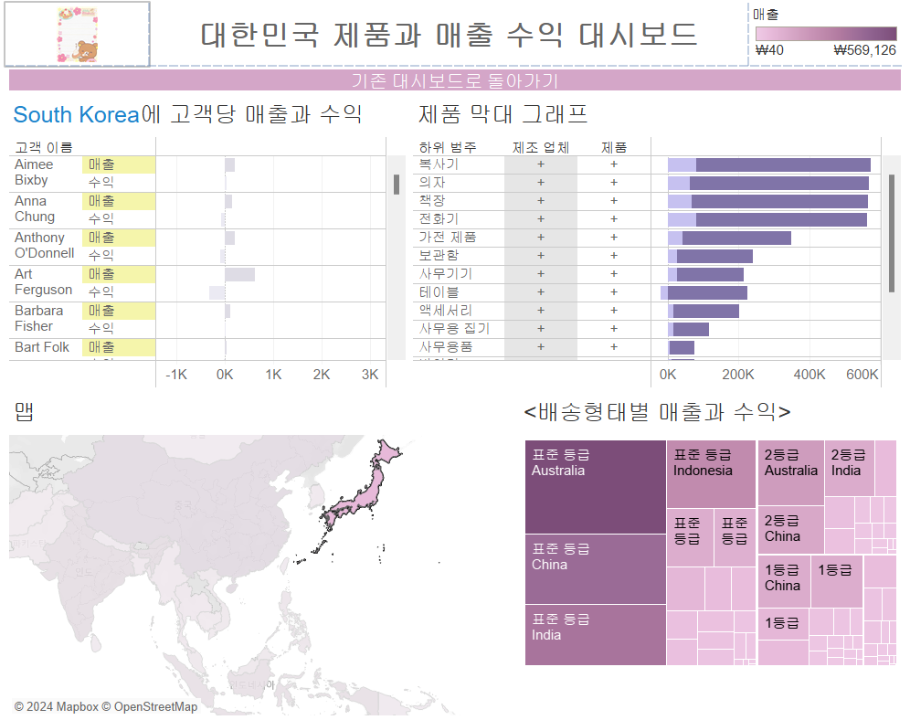

# Sixth Study Week


## Study Schedule
<br>

| 회차 | 강의 범위   | 강의 이수 여부 | 링크                                                                                                     |
|------|-------------|----------------|--------------------------------------------------------------------------------------------------------|
| 1    | 1~7강       | ✅              | [링크](https://www.youtube.com/watch?v=AXkaUrJs-Ko&list=PL87tgIIryGsa5vdz6MsaOEF8PK-YqK3fz&index=84)    |
| 2    | 8~17강      | ✅              | [링크](https://www.youtube.com/watch?v=AXkaUrJs-Ko&list=PL87tgIIryGsa5vdz6MsaOEF8PK-YqK3fz&index=75)    |
| 3    | 18~27강     | ✅              | [링크](https://www.youtube.com/watch?v=AXkaUrJs-Ko&list=PL87tgIIryGsa5vdz6MsaOEF8PK-YqK3fz&index=65)    |
| 4    | 28~37강     | ✅              | [링크](https://www.youtube.com/watch?v=e6J0Ljd6h44&list=PL87tgIIryGsa5vdz6MsaOEF8PK-YqK3fz&index=55)    |
| 5    | 38~47강     | ✅              | [링크](https://www.youtube.com/watch?v=AXkaUrJs-Ko&list=PL87tgIIryGsa5vdz6MsaOEF8PK-YqK3fz&index=45)    |
| 6    | 48~57강     | ✅              | [링크](https://www.youtube.com/watch?v=AXkaUrJs-Ko&list=PL87tgIIryGsa5vdz6MsaOEF8PK-YqK3fz&index=35)    |
| 7    | 58~67강     | 🍽️             | [링크](https://www.youtube.com/watch?v=AXkaUrJs-Ko&list=PL87tgIIryGsa5vdz6MsaOEF8PK-YqK3fz&index=25)    |
| 8    | 68~77강     | 🍽️             | [링크](https://www.youtube.com/watch?v=AXkaUrJs-Ko&list=PL87tgIIryGsa5vdz6MsaOEF8PK-YqK3fz&index=15)    |
| 9    | 78~85강     | 🍽️             | [링크](https://www.youtube.com/watch?v=AXkaUrJs-Ko&list=PL87tgIIryGsa5vdz6MsaOEF8PK-YqK3fz&index=5)     |
---

<br/>
<!-- 여기까진 그대로 둬 주세요-->

> **🧞‍♀️ 오늘은 강의보다 실습과 대시보드 직접 만들기가 더 중요하니, 기록보다는 사고하며 강의를 들어주세요.**

## 48. 워크시트 서식(2)

- 서식 => 테두리 서식 클릭


## 49강. 대시보드패널


## 50. 대시보드 구성방식


> **🧞‍♀️ 부동과 바둑판식 방식을 차이를 중점으로 기술해보세요**
```
바둑판식: 격자무늬에 따라 개체 배치
(대시보드 크기가 자주 변경되는 경우 추천)
부동: 사용자가 원하는대로
```


## 51. 대시보드 컨테이너
- 컨테이너: 대시보드 개체들과 워크시트들을 그룹화하고 구성할 수 있는 공간
    - 가로 컨테이너: 내부 개체들을 수평공간으로 배열할 때 
    - 세로 컨테이너: 수직공간으로 배열

- 높이 편집: 움직이게 하는 두줄짜리 창 더블 클릭 => 오른쪽에 있는 역삼각형 표시 => 높이편집 


<항목 계층>


## 52. 레이아웃 패널

- 레이아웃에서 개체 `위치`는 `부동` 체크해야 픽셀 단위로 이동 가능 

## 53. 필터 동작

- 대시보드 동작: 국가와 같이 선택 항목이 많은 경우


ex. 맵 차트에서 호주를 클릭하면 다른 워크시트들이 `호주`에 대한것으로 변경됨


> 워크시트 연계 : 대시보드(B) 탭 => 동작
- 원본 시트: 동작을 적용할 수 있는 워크시트 지정
- 대상 시트: 동작을 실행하면 변경될 워크시트 

## 54. 대시보드 하이라이터 동작

- 각 주문id의 하위범주별로 분산형 차트 나타냄


## 55. 대시보드 URL


## 56. 대시보드 시트에 이동 동작


- alt 키 누르고 버튼 누르면 기존 대시보드로 이동한다!


## 57. 매개변수 변경 동작


## 문제

오늘은 별도의 문제가 없습니다. 


여러 대시보드를 참고하시어, superstore 데이터를 사용해 나만의 대시보드를 제작해주세요.

**단, 워크시트 3개 이상의 그래프를 표시해야 하며 각 시트 간 상호작용성 필터 or 하이라이트 동작은 꼭 추가되어야 합니다**

어떤 부분에 가중을 두었는지, 어떤 사용자 편의성을 고려하였는지에 대한 설명이 필요합니다.



1. 고객당 매출 선택하면 해당 하이라이트 동작 표시되도록
2. 샘플 시트와 상호작용하도록 버튼 삽입
3. 국가/지역 사이트 이동하도록 (맵시트)