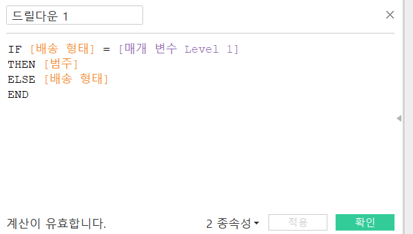

# 7th Study Week

## Study Schedule
 

| 회차 | 강의 범위   | 강의 이수 여부 | 링크                                                                                                     |
|------|-------------|----------------|--------------------------------------------------------------------------------------------------------|
| 1    | 1~7강       | ✅              | [링크](https://www.youtube.com/watch?v=AXkaUrJs-Ko&list=PL87tgIIryGsa5vdz6MsaOEF8PK-YqK3fz&index=84)    |
| 2    | 8~17강      | ✅              | [링크](https://www.youtube.com/watch?v=AXkaUrJs-Ko&list=PL87tgIIryGsa5vdz6MsaOEF8PK-YqK3fz&index=75)    |
| 3    | 18~27강     | ✅              | [링크](https://www.youtube.com/watch?v=AXkaUrJs-Ko&list=PL87tgIIryGsa5vdz6MsaOEF8PK-YqK3fz&index=65)    |
| 4    | 28~37강     | ✅              | [링크](https://www.youtube.com/watch?v=e6J0Ljd6h44&list=PL87tgIIryGsa5vdz6MsaOEF8PK-YqK3fz&index=55)    |
| 5    | 38~47강     | ✅              | [링크](https://www.youtube.com/watch?v=AXkaUrJs-Ko&list=PL87tgIIryGsa5vdz6MsaOEF8PK-YqK3fz&index=45)    |
| 6    | 48~57강     | ✅              | [링크](https://www.youtube.com/watch?v=AXkaUrJs-Ko&list=PL87tgIIryGsa5vdz6MsaOEF8PK-YqK3fz&index=35)    |
| 7    | 58~66강     | ✅             | [링크](https://www.youtube.com/watch?v=AXkaUrJs-Ko&list=PL87tgIIryGsa5vdz6MsaOEF8PK-YqK3fz&index=25)    |
| 8    | 67~77강     | 🍽️             | [링크](https://www.youtube.com/watch?v=AXkaUrJs-Ko&list=PL87tgIIryGsa5vdz6MsaOEF8PK-YqK3fz&index=15)    |
| 9    | 78~85강     | 🍽️             | [링크](https://www.youtube.com/watch?v=AXkaUrJs-Ko&list=PL87tgIIryGsa5vdz6MsaOEF8PK-YqK3fz&index=5)     |
---

 

> **🧞‍♀️ 오늘은 강의보다 실습과 대시보드 직접 만들기가 더 중요하니, 기록보다는 사고하며 강의를 들어주세요.**

## 58. 집합값 변경

해당 하위범주의 제품을 만드는 제조업체만 표시된다. 

## 59강. 스토리패널

- 스토리 각각의 개별 시트를 **스토리 포인트** 라고 한다. 

## 60. 스토리

- 스토리: 생성한 워크시트와 대시보드에 설명을 덧붙여 데이터를 설명하기 위한 정보를 전달하고, 의사결정에 도움을 주고 설득력있는 사례를 구성

## 61. 대시보드 탐색

## 62. 태블로 단추

- 부동이 해제된 표시 숨기기 단추를텍스트 오른쪽으로 옮김

## 63. 막대그래프 드릴다운

- 같은 방식으로 매개변수 level 2를 생성하여 `범주 -> 하위범주 드릴다운`을 생성

## 64. 트리맵 드릴다운

- 드릴다운이 카테고리 - 서브 카테고리 - 제조업체 순서로 이루어지도록하는 트리맵. 

## 65. 파이 차트 드릴다운

## 66. 지도 드릴다운

---

## 문제

오늘은 별도의 문제가 없습니다.

저번 주와 마찬가지로 여러 대시보드를 참고하시어, 학술제 주제 관련 데이터(없을 경우, 본인 관심 데이터)를 사용해 나만의 대시보드를 제작해주세요.

**단, 워크시트 3개 이상의 그래프를 표시해야 하며 각 시트 간 상호작용성 필터 or 하이라이트 동작은 꼭 추가되어야 합니다**

어떤 부분에 가중을 두었는지, 어떤 사용자 편의성을 고려하였는지에 대한 설명이 필요합니다.

드릴다운 시트를 활용하여 클릭하면 해당 시트로 이동할 수 있게 동작한 드릴다운 대시보드를 만들었다... 