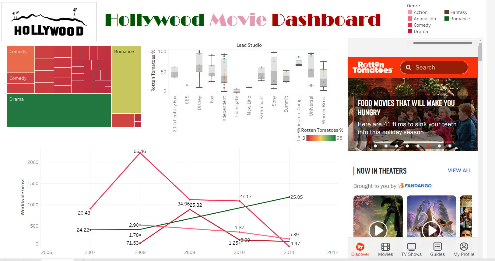

# 9주차 문제

여러 대시보드를 참고하시어, 학술제 주제 관련 데이터(없을 경우, 본인 관심 데이터)를 사용해 나만의 대시보드를 제작해주세요.

**단, 워크시트 3개 이상의 그래프를 표시해야 하며 각 시트 간 상호작용성 필터 or 하이라이트 동작은 꼭 추가되어야 합니다.**

어떤 부분에 가중을 두었는지, 어떤 사용자 편의성을 고려하였는지에 대한 설명이 필요합니다.

---

### 사용한 데이터셋
https://public.tableau.com/app/learn/sample-data
(2007~2012년에 발표된 영화의 제목, 장르, 제작사, 수익률 및 등급)

### 대시보드 링크(태블로 퍼블릭)
ㅠㅠ 태블로 퍼블릭에 저장이 안돼용

---
### 대시보드 설명

**[메인 대시보드 구성]**
 - 영화 장르별로 profitability 트리맵  (클릭하면 세부 영화의 profitability가 보여지는 대시보드 동작 추가)
 - lead studio별 rotten tomato 지수 boxplot 
 - 연도별 worldwide gross 추이 그래프  (레이블의 숫자는 profitability)
 - rotten tomato 웹페이지 링크 